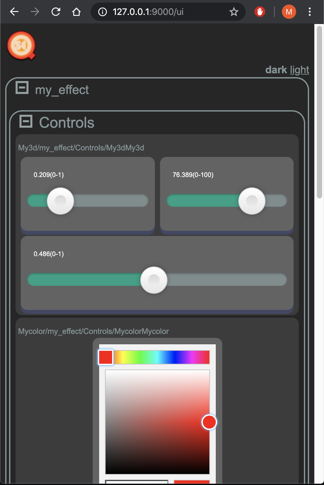

# Touchdesigner OSC Query Server Component 

## What is this?

This repository contains a Touchdesigner component to expose Touchdesigner container custom parameters via an OSC Query server.
This allows a OSC Query client to control these custom parameters with (almost) no setup.

## What is OSC Query?

OSC Query is a specification through which a server can expose what OSC messages it is able to process. 
The specification can be found at: https://github.com/Vidvox/OSCQueryProposal

The OSC query server exposes defintion of it's OSC API which includes OSC addresses and arguments (plus it's type, min/max, current value) through a webserver that serves JSON documents.

## How to use this?

### Use an external OSC Query client

Here you can find a quick demo video using Chataigne as the client:
https://youtu.be/RqZfEz4F5FU

1. Add the osc_query_server.tox to your project
2. Select the created container and go to it's "COMP 1-5" tab
3. Add the name of your COMP (e.g. container), who's custom parameters you want to control, to the parameter "COMP 1"
4. Use a OSC Query client to connect to the component the port specified (default: 9000); e.g. 127.0.0.1:9000 if it's on your local machine
5. Done. Use your client to control the custom parameters.

### Use the included OSC Query web app

This project also serves an OSC Query web client at http://IP:Port/ui (on your local machine that is http://127.0.0.1:9000/ui)
You can just open your browser and directly interact with the control UI.

The bundled web client was developed by Vidvox:
https://github.com/Vidvox/oscqueryhtml

## What is missing?

### Zeroconf/Bonjour

The OSC Query specification defines that the OSC Query server should announce it's service through bonjour/zeroconf. This means a client would not even need to enter the IP + port of the server, but can present a list of detected OSC Query servers. 

The bonjour/zeroconf announcement is currently not implemented. It seems a bit tricky to implement a DNS client in Touchdesigner.
Unfortunately, some OSC Query clients (e.g. Vezér) do not provide an option to input IP + port for OSC Query servers. 

## What Touchdesigner version does it support?

This component is compatible with Touchdesigner 2020.x and newer.
It uses the Webserver DAT that was introduced in this TD version.

## Found a bug or want a feature?

Please file a issue or add a pull request.

## Changelog

## 1.3.1

* Adds Momentary and Float parameter with size greater than 1

## 1.3.0

* Adds bi-directional communication

## 1.2.0

* Web App: A web OSCQuery client is now bundled.

## 1.1.0

* Now includes ACCESS attribute in OSCQuery Json => read-only for parameters that have a expression or export mode.
* Code refactor

### 1.0.0
First version

## Acknowledgement

This component bundles two open source projects. They are included with the component and there is no install step.

* OSCQuery Web App: https://github.com/Vidvox/oscqueryhtml
* osc4py3 (oscbuildparse): https://pypi.org/project/osc4py3/